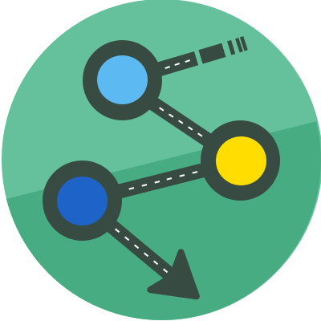

# LDES2Service

LDES2Service is a set of NPM packages you can use to replicate an LDES in a back-end system of choice.

A Linked Data Event Stream (LDES) is a collection of immutable objects. The HTTP interface adheres to the [LDES specification](https://w3id.org/ldes/specification) by SEMIC. An LDES can be fragmented in different ways using the [TREE specification](https://w3id.org/tree/specification). Check the [TREE Linked Data Fragments website](https://tree.linkeddatafragments.org) for more background and implementations.

<div align="center">
    
</div>

## Installation

```bash
npm install
npm run build
npm run start -- -h
```

## Components

**ldes-dummy-connector:**<br />
An example to write your own connector.

**ldes-postgres-connector:**<br />
A connector implementation for PostgreSQL.

**ldes-mongodb-connector:**<br />
A connector implementation for MongoDB.

**ldes-graphdb-connector:**<br />
A connector implementation for GraphDB. (can be easily extended to any other datastore compatible with SPARQL)

**ldes-dummy-state:**<br />
An example to write your own state.

**ldes-redis-state:**<br />
A state implementation for Redis.

**ldes-replicator:**<br />
Allows you to replicate any amount of LDES into different backends via connectors.

**ldes-types:**<br />
Contains all the LDES2Service type definitions.

**docker-compose-generator:**<br />
Generates a docker-compose file to run an LDES replicator and its connected backends with user provided settings
and the metadata provided by the connectors.

**helm-file-generator:**<br />
Generates a helmfile to run an LDES replicator and its connected backends with user provided settings
and the metadata provided by the connectors.

**generator-rest-api:**<br />
Exposes the helm/compose file generators as a Fastify plugin.

**ldes-app:**<br />

## Students

- [Arno Troch](https://github.com/ArnoTroch)
- [Carlos Ruiz](https://github.com/D34DPlayer)
- [Clément Vandendaelen](https://github.com/LotuxPunk)
- [Ryan Byloos](https://github.com/ryanbyloos)
- [Wout Verbiest](https://github.com/woutverbiest)

## Config file

The LDES Replicator is a CLI that takes a JSON file for configuration.

```json
{
  // Main settings
  "replicator": {
    "ldes": [
      {
        "url": "URL to the LDES"
      },
      {
        "url": "URL to the LDES",
        "shapeUrl": "URL or path of a SHACL shape"
      }
    ],
    "state": {
      "id": "Used to identify the state in a shared redis server",
      "host": "hostname",
      "port": "port number",
      "password": "password, if needed"
    },
    "polling_interval": "delay in ms"
  },
  // Connector settings
  "connectors": {
    "PG": {
      // NPM package to use as a connector
      "type": "@ldes/ldes-graphdb-connector",
      // Connector specific settings cf. Connectors
      "settings": {
        ...
      }
    }
  }
}
```

Once the config file is created you can start the LDES replicator with `npm run start -- <config_path>`

## Running it with Docker

The LDES Replicator is available as a docker image: `ghcr.io/osoc21/ldes-replicator:helm-chart`

### Requirements

A redis server and a backend server of your choice are needed for the LDES replicator to work,

### Start a LDES Replicator instance

```shell
docker run \
  -e URLS=ldes.example \
  -e STATE_CONFIG={"host":"127.0.0.1", "id":"replicator"} \
  -e CONNECTORS=[0] \
  -e CONNECTOR_0_TYPE=ldes-backend-connector \
  -e CONNECTOR_0_CONFIG={...} \
  ghcr.io/osoc21/ldes-replicator:latest
```

### Environment Variables

Environment used to automatically create a [Config file](#config-file), otherwise those can be ignored
and a config file mounted at `./config.json`.

- `URLS`: comma-separated list of LDES URLs.
- `STATE_CONFIG`: JSON object with the Redis connection settings.

```js
{
  //Used to separate the state of different replicators in a shared Redis server
  "id": string,
  //The Redis server hostname/IP address and port
  "host": string,
  "port": number,
  //The Redis server password, if needed
  "password": string
}
```

- `POLL_INTERVAL`: The amount of ms the replicator will wait before requesting an update.
- `CONNECTORS`: JSON array containing the IDs of the connectors to use.
- `CONNECTOR_<ID>_TYPE`: Name of the NPM package to use as a backend connector, a list of those can be found below.
- `CONNECTOR_<ID>_CONFIG`: JSON object with the backend connector settings, those will depend on the connector used.

## Connectors

### Generic settings

The connectors will try to implement generic settings to allow a more customizable replication
(ex. keep X versions, store X field as geospatial...):

```js
CONFIG:
{
  // Handles versioning, a SHACL shape is required. If not provided all the versions will be kept.
  versions: {
    // Amount of versions to keep
    amount: number,
    // Field of the LDES that identifies versions of the same object
    identifier: string,
    // Field of the LDES used to sort the versions (and get rid of the older ones)
    sorter: string,
  },
  "other connector specific settings": ...
}
```

### @ldes/ldes-postgres-connector

Stores the Linked Data Events inside a postgres DB backend.

```js
CONFIG:
{
  //The Postgres server credentials
  "username": string,
  "password": string,
  "database": string,
  //The Postgres server hostname/IP address and port
  "hostname": string,
  "port": number
}
```

### @ldes/ldes-mongodb-connector

Stores the Linked Data Events inside a MongoDB backend.

```js
CONFIG:
{
  //The MongoDB server credentials, if needed
  "username": string,
  "password": string,
  "database": string,
  //The MongoDB server hostname/IP address and port
  "hostname": string,
  "port": number
}
```

### @ldes/ldes-graphdb-connector

Stores the Linked Data Events inside a GraphDB backend.

```js
CONFIG:
{
  //The GraphDB server credentials, if needed
  "password": string,
  "database": string,
  //The GraphDB server connection string and the repository to use
  "baseUrl": string,
  "repository": number,
  //Each ldes is stored in a different graph, with this you can provide their URI prefix
  "graphPrefix": string
}
```

### Docker-compose

Docker compose can be used to host the Redis server, LDES Replicator and on the same dedicated server.

```yaml
version: "3"

services:
  postgres: # Backend service...
  redis: # Redis service ...
  replicator:
    build: .
    image: ghcr.io/osoc21/ldes-replicator
    environment:
      URLS: LDES.example/
      STATE_CONFIG: '{
        "id":"replicator",
        "host":"redis"
      }'
      POLL_INTERVAL: '5000'
      CONNECTORS: '[postgres]'
      CONNECTOR_postgres_TYPE: '@ldes/ldes-postgres-connector'
      CONNECTOR_postgres_CONFIG: '{
        "username":"postgres",
        "password":"postgres",
        "database":"postgres",
        "hostname":"postgres",
        "port":5432
      }'
```

Full example [here](https://github.com/osoc21/ldes2service/blob/main/docker-compose.yml).

### Helm

A helm chart is also available but hasn't been published to a Chart repository yet.

To add an LDES replicator to your cluster:

```shell
git clone https://github.com/osoc21/ldes2service.git
cd ldes2service/ldes-replicator-helm
helm install --generate-name .
```

### Helmfile

Helmfile can be used to set the Replicator setting more easily.

```yaml
releases:
  - name: ldes-replicator
    chart: ./ldes2service/ldes-replicator-helm
    values:
      - replicator:
          urls:
            - 'LDES.example'
            - 'LDES2.example'
          state:
            id: 'replicator'
            host: 'redis-master'
          polling_interval: 5000
        connectors:
          PG:
            type: '@ldes/ldes-postgres-connector'
            settings:
              username: 'postgres'
              password: 'postgres'
              database: 'postgres'
              hostname: 'postgresql'
              port: 5432
```

## License

This project is released as an open-source project under the [MIT License](https://github.com/osoc21/ldes2service/blob/main/LICENSE)
